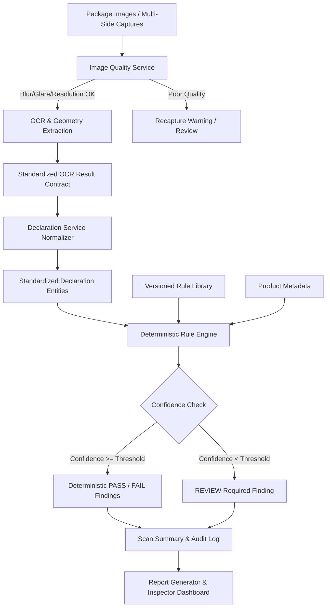

# LegalMetrix AI — System Architecture

## 1. Project Overview & SIH26034 Problem Statement
**LegalMetrix AI** is an enterprise-grade, explainable compliance verification platform for packaged commodities governed under the **Legal Metrology (Packaged Commodities) Rules, 2011** (India).

The system verifies mandatory packaging declarations (e.g. MRP, Net Quantity, Manufacturer details, Consumer Care contacts) using automated computer vision and OCR pipelines, coupled with an auditable, deterministic legal rule engine.

---

## 2. Core Architectural Principle: Deterministic Rule Engine
A foundational architectural mandate is the **strict separation of evidence extraction from compliance determination**:

> [!IMPORTANT]
> - **AI / OCR strictly acts as an Evidence Extractor**: CV and OCR models only detect text regions, bounding boxes, and extract text representations with statistical confidence scores.
> - **Zero Black-Box Compliance Decisions**: Compliance is **NEVER** evaluated by an unconstrained LLM or probabilistic model directly.
> - **Deterministic Rule Execution**: Compliance decisions are computed by a versioned, declarative Rule Engine that executes clear, reproducible logic.
> - **Human-in-the-Loop Review**: If OCR or extraction confidence fails to meet configured quality thresholds, the pipeline immediately flags the state as `REVIEW` instead of making an erroneous `PASS` or `FAIL` verdict.

---

## 3. High-Level Pipeline Data Flow

---

## 4. Layered Modular Architecture

### Backend (Python / FastAPI / SQLAlchemy / Alembic)
- **`app.api` / `app.routers`**: Thin HTTP controller layer exposing REST endpoints.
- **`app.schemas`**: Pydantic v2 domain contracts strictly validating input/output payloads.
- **`app.services`**:
  - `ImageQualityService`: Pre-flight verification (sharpness, lighting, resolution).
  - `OCRService`: Pluggable OCR interface (PaddleOCR, Tesseract, OCR-VQA) emitting bounding box geometry.
  - `DeclarationService`: Categorizes raw text into structured taxonomy models.
  - `RuleService`: Executes versioned legal rules against declarations deterministically.
- **`app.models`**: SQLAlchemy 2.0 ORM models mapping to PostgreSQL tables.
- **`app.core`**: Central configuration, database engine sessions, enums, and constants.

### Database (PostgreSQL 15+)
- Robust relational schema with JSONB support for flexible rule definitions, normalized values, and evidence references.
- Complete foreign key hierarchy, UTC timestamp auditing, and indexing on frequent lookup fields.

### Frontend (React 18+ / Vite / React Router / Axios)
- Modern GovTech interface prioritizing clarity, contrast, and auditability.
- Structured components for inspection workflows, violation badges, bounding box overlays, and declaration inspection.
