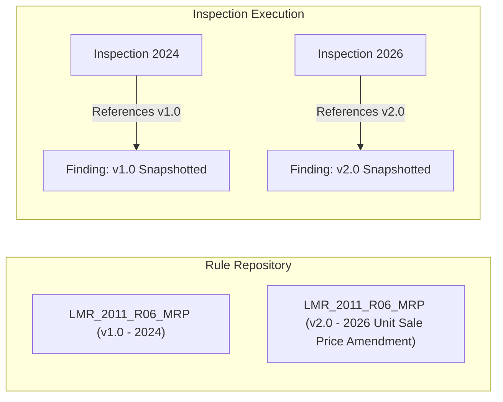

# LegalMetrix AI — Compliance Rule Engine & Versioning Design

## 1. Core Philosophy: Reproducible Legal Decisions
Legal Metrology enforcement requires **unquestionable auditability** and **reproducibility**. If an inspection performed in 2026 is audited or contested in court in 2028, the system must be able to demonstrate:
1. The exact raw image evidence.
2. The exact OCR and declaration extractions with confidence scores.
3. The exact version of the legal rule executed at that specific moment in time.

---

## 2. Rule Representation & Schema

Rules are stored in `compliance_rules` and validated against `RuleDefinition` Pydantic models. They are written in declarative JSON rather than hardcoded in application logic.

### Example Rule Definition JSON:

```json
{
  "rule_code": "LMR_2011_R06_MRP",
  "name": "Mandatory Maximum Retail Price Declaration",
  "description": "Rule 6(1)(e): Declaration of Retail Sale Price including all taxes.",
  "declaration_type": "MRP",
  "rule_version": "2011.1.0",
  "severity": "HIGH",
  "rule_definition": {
    "type": "presence",
    "target": "MRP",
    "conditions": [
      {
        "field": "normalized_value.currency",
        "operator": "in",
        "value": ["INR", "Rs", "₹"]
      },
      {
        "field": "normalized_value.taxes_inclusive",
        "operator": "eq",
        "value": true
      }
    ],
    "min_confidence": 0.80,
    "on_missing": "FAIL",
    "on_low_confidence": "REVIEW",
    "expected_format": "MRP Rs. XX.XX (incl. of all taxes)"
  }
}
```

---

## 3. Rule Versioning Architecture



### Immutable Snapshotting:
- The `compliance_rules` table enforces a unique constraint on `(rule_code, rule_version)`.
- When legal rules change (e.g. government amendments), a **new version row** is created rather than updating existing records in-place.
- Every `compliance_findings` row retains:
  - `rule_id` (foreign key)
  - `rule_code` (e.g., `LMR_2011_R06_MRP`)
  - `rule_version` (e.g., `2011.1.0`)
  - `detected_value` (JSON snapshot of what was seen)
  - `expected_requirement` (JSON snapshot of what was legally required)
  - `confidence` (OCR / extraction confidence score)
  - `evidence_reference` (reference to source image & OCR bounding boxes)

---

## 4. Confidence Thresholds & Review Routing

```
Confidence Score >= 0.80  ---> Deterministic PASS / FAIL Evaluation
Confidence Score < 0.80   ---> Flagged as REVIEW (Inspector Attention Required)
Occluded / Unclear Image  ---> Flagged as REVIEW (Recapture Recommended)
```

No uncertain prediction is ever finalized as a violation or compliance without human inspector verification.
