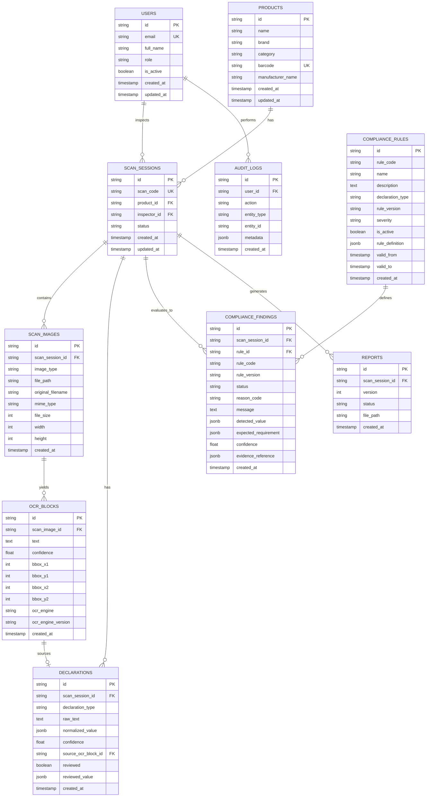

# LegalMetrix AI — Database Design

## 1. Relational Entity Relationship Diagram

---

## 2. Table Specifications & Indexing Strategy

1. **`users`**:
   - `id`: Primary key (UUID string)
   - `email`: Indexed unique string
   - `role`: Enum (`ADMIN`, `INSPECTOR`, `REVIEWER`)
2. **`products`**:
   - Indexed on `barcode` (unique), `name`, `brand`, `category` for rapid lookup during barcode scans.
3. **`scan_sessions`**:
   - Indexed on `scan_code` (unique), `product_id`, `inspector_id`, and `status`.
4. **`scan_images`**:
   - Indexed on `scan_session_id`.
5. **`ocr_blocks`**:
   - Indexed on `scan_image_id`. Coordinates (`bbox_x1`, `bbox_y1`, `bbox_x2`, `bbox_y2`) store region pixels.
6. **`declarations`**:
   - Indexed on `scan_session_id` and `declaration_type`.
   - `normalized_value` stores typed JSON (e.g. `{amount: 120, currency: "INR"}`).
   - Separate `reviewed` flag and `reviewed_value` ensure full audit trail separating machine extractions from human overrides.
7. **`compliance_rules`**:
   - Unique composite constraint on `(rule_code, rule_version)`.
   - `rule_definition` (JSONB) defines the exact deterministic conditions executed by the engine.
8. **`compliance_findings`**:
   - Indexed on `scan_session_id`, `rule_id`, `rule_code`, and `status`.
   - Retains immutable snapshots of `rule_code`, `rule_version`, `detected_value`, and `expected_requirement`.
9. **`reports`**:
   - Indexed on `scan_session_id`.
10. **`audit_logs`**:
   - Indexed on `user_id`, `action`, `entity_type`, `entity_id`.

---

## 3. Migration Strategy
Migrations are managed strictly via **Alembic** (`backend/alembic/versions/`). No direct schema manipulation via raw DDL is permitted in production environments.
