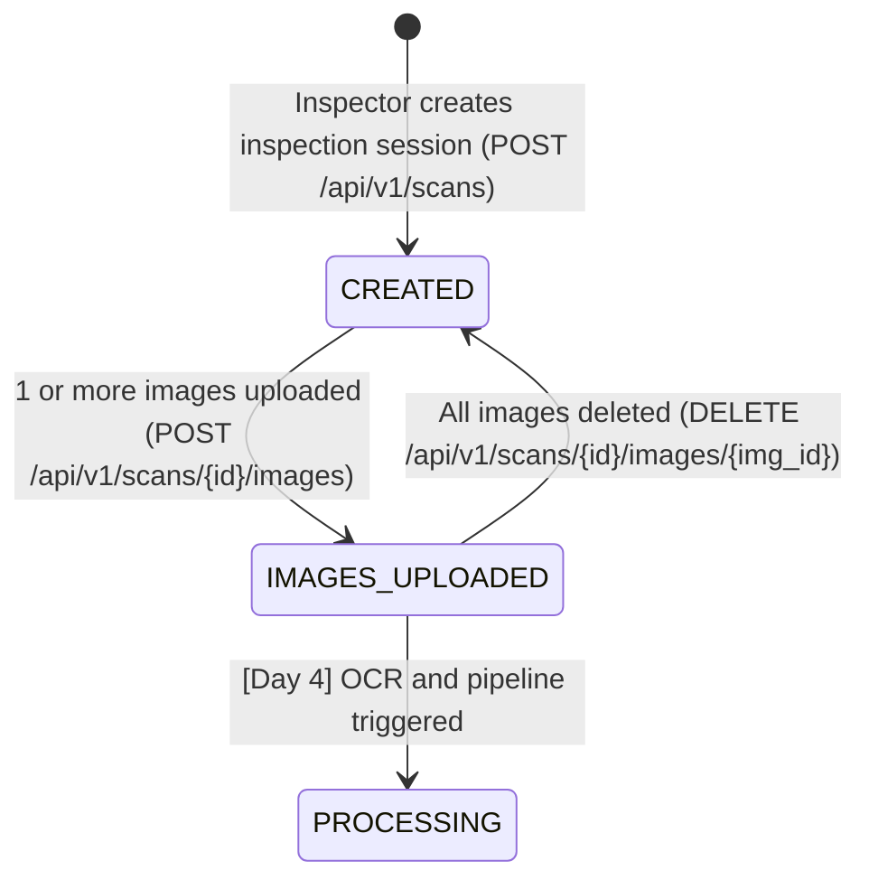

# Day 3 — Product Capture, Upload, and Scan Sessions

## Overview

Day 3 of **LegalMetrix AI (SIH26034)** implements end-to-end evidence capture for packaging label inspections. Authenticated **INSPECTORS** can create new scan sessions, capture or reuse product metadata by barcode, upload multi-angle package label images (JPEG, PNG, WebP), classify label panels (`FRONT`, `BACK`, `SIDE`, `TOP`, `BOTTOM`, `OTHER`), reorder/remove images, preview images securely, and recover scan sessions after browser refresh.

---

## 1. Scan Lifecycle & Status Transitions



- **`CREATED`**: Scan session initiated; product metadata attached or generated; unique scan code assigned (e.g., `SCAN-2026-000001`).
- **`IMAGES_UPLOADED`**: Label panel evidence uploaded, validated via Pillow, EXIF-normalized, and stored.

---

## 2. API Endpoints

| Method | Endpoint | Allowed Roles | Description |
| :--- | :--- | :--- | :--- |
| `POST` | `/api/v1/scans` | `INSPECTOR`, `ADMIN` | Initiate new scan session with optional product metadata |
| `GET` | `/api/v1/scans` | Authenticated | List scans (Inspectors see own scans; Admin/Reviewer see all) |
| `GET` | `/api/v1/scans/{scan_id}` | Authenticated | Fetch scan details, product info, and ordered images |
| `POST` | `/api/v1/scans/{scan_id}/images` | `INSPECTOR`, `ADMIN` | Multipart upload of packaging images (validates & stores) |
| `GET` | `/api/v1/scans/{scan_id}/images/{image_id}/content` | Authenticated | Stream protected preview image content |
| `DELETE` | `/api/v1/scans/{scan_id}/images/{image_id}` | `INSPECTOR`, `ADMIN` | Delete image record and physical storage file |
| `PATCH` | `/api/v1/scans/{scan_id}/images/order` | `INSPECTOR`, `ADMIN` | Update display order of uploaded images |
| `GET` | `/api/v1/products/by-barcode/{barcode}` | Authenticated | Lookup existing product metadata for auto-fill |

---

## 3. Storage Architecture

Storage is decoupled behind `StorageServiceInterface`:

- **Interface**: `StorageServiceInterface` (`save_file`, `delete_file`, `get_file_path`, `exists`).
- **Local Implementation**: `LocalStorageService` saving files to:
  ```text
  backend/storage/scans/<scan_id>/<uuid>.<ext>
  ```
- **Security & Integrity**:
  - Path traversal checks prevent directory breakout (`../../`).
  - Stored filenames are randomly generated UUIDs (never raw user filenames).
  - Transactional rollback: if database persistence fails after file write, newly written files are cleaned up immediately.

---

## 4. Image Validation & Intake Pipeline

1. **Format Validation**: Only `JPEG`, `PNG`, and `WEBP` are accepted. Fake extensions, text files disguised as images, GIFs, PDFs, and SVGs are rejected with HTTP 400.
2. **File Size Limit**: Configurable via `MAX_UPLOAD_SIZE_MB=10` (HTTP 413 on breach).
3. **Session Image Limit**: Configurable via `MAX_IMAGES_PER_SCAN=8` (HTTP 400 on breach).
4. **EXIF Normalization**: `ImageOps.exif_transpose` corrects mobile camera rotation tags into normalized pixel matrices before saving.
5. **Safe Downscaling**: Very high resolution camera captures (>3500px long edge) are gently scaled down with high-quality Lanczos resampling, retaining fine text contrast for OCR without distorting aspect ratio. Small images are never upscaled.
6. **Duplicate Detection**: Computes SHA-256 hash on intake. If an identical image is uploaded within the same scan session, returns `409 Conflict`.

---

## 5. Security & Ownership Model

- **Authentication**: JWT Bearer token via `Authorization: Bearer <token>`.
- **Role Permissions**:
  - `INSPECTOR`: Full access to create, upload, reorder, and delete own scans. IDOR protection prevents modifying another inspector's scan.
  - `ADMIN`: Full administrative and inspection oversight.
  - `REVIEWER`: Read-only access to view scans and evidence; forbidden (`403`) from creating scans or altering evidence.
- **Audit Logging**: Structured immutable audit trail recorded for `SCAN_CREATED`, `IMAGE_UPLOADED`, `IMAGE_DELETED`, `IMAGE_REORDERED`.

---

## 6. Frontend Features

- **Multi-panel UploadZone**: Drag-and-drop & file picker, progress/status badges (`WAITING`, `UPLOADING`, `UPLOADED`, `FAILED`), panel classification dropdown, Move Up/Down reordering, and Remove actions.
- **Product Metadata**: Fields for Product Name, Brand, Category, Barcode, and Manufacturer with instant barcode lookup.
- **Browser Refresh Recovery**: Dynamic route `/scans/:scanId` restores product metadata, scan status, and persisted image evidence from the backend upon reload.
