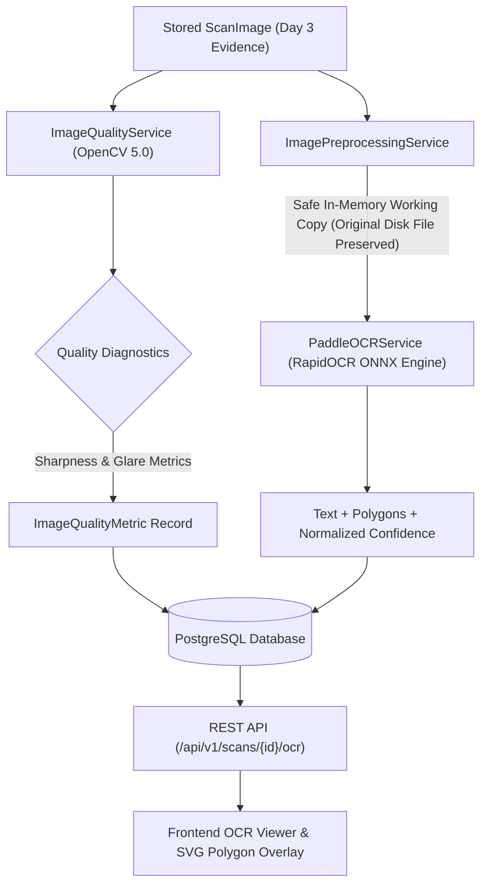

# Day 4 Architecture Documentation — Image Quality Engine + OCR & Layout Extraction

**Project:** LegalMetrix AI  
**SIH Problem Statement:** SIH26034 — Automated Compliance Verification for Legal Metrology Packaged Commodities Rules  
**Phase:** Day 4 — Image Quality Diagnostics & Local OCR Layout Extraction

---

## 1. Architectural Guardrails & Principles

> [!IMPORTANT]
> **Strict Separation of Evidence Extraction vs. Legal Evaluation:**  
> OCR and Computer Vision extract objective visual evidence. **They DO NOT make legal compliance decisions.**  
> - Low OCR confidence or blurred images generate `REVIEW` or `RECAPTURE RECOMMENDED` warnings.  
> - Missing OCR text is **never** automatically treated as a Legal Metrology violation.  
> - Deterministic Legal Metrology rule verification belongs exclusively to subsequent pipeline stages.

---

## 2. End-to-End Pipeline Architecture

---

## 3. OpenCV Image Quality Engine

### A. Sharpness / Blur Detection (Variance of Laplacian)
Sharpness is computed using the variance of the 2D Laplacian operator on grayscale luminance:
\[
\text{Blur Score} = \text{Var}\left(\nabla^2 I\right) = \frac{1}{N} \sum_{x,y} \left( \nabla^2 I(x,y) - \mu_{\nabla^2} \right)^2
\]
- **Interpretation:** High values indicate sharp character edges; low values indicate defocus or motion blur.
- **Engineering Threshold:** `IMAGE_BLUR_THRESHOLD = 100.0` (configurable in `.env`).
- **Severity Action:** Score \(< 40.0\) triggers `RECAPTURE_RECOMMENDED`.

### B. Glare / Specular Highlight Detection (Background-Aware Specular Analysis)
Specular reflections on glossy plastic packaging obscure critical printed declarations.

#### Previous Limitation
In early iterations, the glare detector counted all high-luminance, low-saturation pixels across the whole image canvas. For product packaging photographed on clean white lightbox backgrounds or studio backdrops (such as e-commerce Parle-G Gold biscuit images), the white backdrop itself triggered false-positive glare scores exceeding 40% (threshold 5%), incorrectly flagging high-quality product images as `RECAPTURE_RECOMMENDED`.

#### Background-Aware Connected-Component Separation & Specular Highlight Isolation
The production engine uses lightweight, deterministic OpenCV processing:
1. **Candidate Near-White Background Segmentation:** Evaluates high Value and low Saturation in HSV color space along with high luminance:
\[
\text{BG Candidate Pixels} = (V \ge 235 \land S \le 35) \lor (I_{\text{gray}} \ge 240)
\]
2. **Border-Connected Component Analysis:** Evaluates 8-connected components touching the 4 image outer borders. Regions with substantial area (\(\ge 0.5\%\) of total image canvas) that connect directly to the borders are classified as uniform background:
\[
\text{BG Mask} = \bigcup_{k \in \text{Border Connected Components}} \text{Component}_k \quad \text{where } \text{Area}_k \ge 0.005 \times N_{\text{total}}
\]
3. **Foreground Extraction:**
\[
\text{FG Mask} = \neg \text{BG Mask}
\]
4. **Foreground-Localized Specular Highlight Detection:** Specular hotspots on the foreground are identified by extreme brightness saturation (\(V \ge 248 \land S \le 25\) or \(I_{\text{gray}} \ge 252\)), followed by a \(3 \times 3\) morphological opening to eliminate isolated single-pixel sensor noise while preserving genuine specular reflection patches:
\[
\text{Glare Score} = \begin{cases}
\frac{\sum \text{Specular Highlight Pixels in FG}}{\sum \text{Foreground Pixels}}, & \text{if } N_{\text{FG}} > 0 \\
\frac{\sum \text{Specular Highlight Pixels}}{\text{Total Pixels}}, & \text{if Foreground cannot be isolated}
\end{cases}
\]
5. **Engineering Heuristic Threshold:** `IMAGE_GLARE_THRESHOLD = 0.05` (5.0% foreground area, configurable via `.env`).
   > [!NOTE]
   > The 5% glare threshold is an OCR-readiness engineering heuristic to ensure text legibility and is **not** a legally mandated Legal Metrology standard.
6. **Severity Actions & Fallbacks:**
   - Score \(> 0.05\) (5% of foreground): Flags `GLARE` warning.
   - Severe Glare (\(> 3.5 \times \text{Threshold} = 17.5\%\)) or Complete Overexposure (\(\ge 98\%\) blowout): Triggers `RECAPTURE_RECOMMENDED`.
   - Ambiguous foreground (\(N_{\text{FG}} < 2\%\) with \(\text{BG} > 95\%\)): Falls back conservatively to `REVIEW`.

#### Remaining Limitations
- **Interior Translucent / Hollow Areas:** If a hollow product (e.g. handle of a transparent jug) has interior white background completely enclosed without connecting to the outer border, it may be treated as foreground.
- **Extreme Overexposure on White Packaging:** If an entirely white package is photographed under massive overexposure such that no edge contrast remains against a white background, the engine conservatively flags `REVIEW` rather than assuming zero glare.

### C. Resolution Verification
- Evaluates spatial dimensions against `MIN_IMAGE_WIDTH = 400` and `MIN_IMAGE_HEIGHT = 400`.
- Dimensions \(< 300\text{px}\) trigger `LOW_RESOLUTION` warning and `RECAPTURE_RECOMMENDED`.

---

## 4. Local OCR Engine (PaddleOCR / RapidOCR ONNX)

### A. 100% Offline / Local Execution
The OCR pipeline utilizes `RapidOCR` with PP-OCR ONNX models. Once local model assets are present, inference executes entirely on-device without cloud API dependencies or external network requests.

### B. Extracted Evidence Structure
Each detected text block produces:
1. **Recognized Text:** Unicode string preserving standard punctuation and symbols (e.g., `₹`, `g`, `kg`, `ml`).
2. **Confidence:** Normalized floating point score in range \([0.0, 1.0]\).
3. **Polygon Geometry:** 4-vertex coordinates `[[x1, y1], [x2, y2], [x3, y3], [x4, y4]]` mapping 1:1 to original image dimensions.
4. **Bounding Box:** Derived axis-aligned bounding box `(x1, y1, x2, y2)`.
5. **Reading Order (`block_order`):** Deterministic natural reading sequence sorted top-to-bottom, left-to-right with adaptive line-band grouping.
6. **Processing Duration:** Execution latency in milliseconds measured with `time.perf_counter()`.

---

## 5. Database Schema Changes

### `image_quality_metrics` Table
| Column | Type | Description |
| :--- | :--- | :--- |
| `id` | `VARCHAR(36)` | Primary Key UUID |
| `scan_image_id` | `VARCHAR(36)` | Foreign Key -> `scan_images.id` (Unique, Cascading) |
| `blur_score` | `FLOAT` | Laplacian variance |
| `glare_score` | `FLOAT` | Specular pixel ratio \([0.0 - 1.0]\) |
| `width`, `height` | `INTEGER` | Pixel dimensions |
| `megapixels` | `FLOAT` | Spatial resolution in MP |
| `resolution_status` | `VARCHAR(50)` | `ACCEPTABLE` or `LOW_RESOLUTION` |
| `orientation_status` | `VARCHAR(50)` | `CORRECT` or `ROTATED` |
| `quality_status` | `VARCHAR(50)` | `ACCEPTED`, `REVIEW`, or `RECAPTURE_RECOMMENDED` |
| `warnings` | `JSONB` / `JSON` | List of diagnostic warning codes |
| `quality_engine_version` | `VARCHAR(50)` | Engine identifier (e.g., `opencv-5.0.0`) |
| `created_at`, `updated_at` | `TIMESTAMP WITH TIME ZONE` | UTC timestamps |

### `ocr_blocks` Table (Updated)
- Added `polygon`: `JSONB` / `JSON` storing 4-point coordinate arrays.
- Added `block_order`: `INTEGER` deterministic sequence index.

### `scan_images` Table (Updated)
- Added `processing_status`: `VARCHAR(50)` (`UPLOADED`, `PROCESSING`, `COMPLETED`, `RECAPTURE_RECOMMENDED`, `FAILED`).
- Added `ocr_processing_duration_ms`: `INTEGER`.

---

## 6. API Endpoints

### 1. Execute Scan Processing
`POST /api/v1/scans/{scan_id}/process`
- **Permissions:** Owning Inspector or Admin.
- **Action:** Runs OpenCV quality analysis and PaddleOCR on all images in the scan session.
- **Idempotency:** Replaces prior OCR blocks within a single transaction without creating duplicate database rows.

### 2. Retrieve OCR Evidence & Diagnostics
`GET /api/v1/scans/{scan_id}/ocr`
- **Permissions:** Authenticated (ownership enforced for Inspectors).
- **Response:** Returns structured list of images, quality metrics, and ordered OCR blocks with polygons.

### 3. Reprocess Single Image
`POST /api/v1/scans/{scan_id}/images/{image_id}/reprocess`
- **Action:** Re-runs quality analysis and OCR on a single image panel.

---

## 7. Frontend OCR Overlay & Quality Diagnostics

- **Responsive SVG Overlay:** Uses SVG `viewBox` bound to the original image dimensions (`naturalWidth` \(\times\) `naturalHeight`), guaranteeing exact polygon alignment regardless of viewport scaling.
- **Confidence Visualization:**
  - High (\(\ge 80\%\)): Green stroke (`#16a34a`)
  - Medium (\(60 - 79\%\)): Amber stroke (`#d97706`)
  - Low (\(< 60\%\)): Red stroke (`#dc2626` - flagged for review)
- **Bidirectional Synchronization:** Hovering a bounding box on the image highlights the corresponding text block in the list and vice versa.
- **Refresh Persistence:** Automatically recovers OCR state and overlays from PostgreSQL on browser refresh.

---

## 8. Benchmark Harness & Metrics

- **CLI Debug Tool:** `python backend/scripts/test_ocr.py <image_path>`
- **Benchmark Suite:** `backend/benchmarks/ocr/benchmark_runner.py`
- **Metrics Computed:**
  - **CER (Character Error Rate):** Levenshtein distance on character sequences.
  - **WER (Word Error Rate):** Levenshtein distance on word tokens.
  - **Processing Latency:** End-to-end quality and OCR duration in ms.
